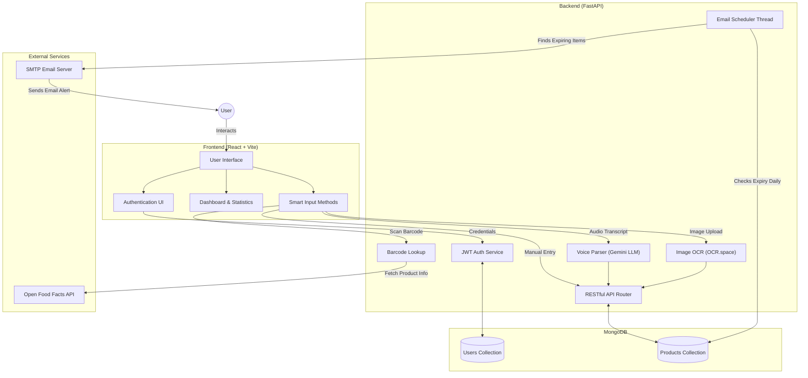

# ExpiryGuard

ExpiryGuard is an intelligent expiry date management system. It allows users to add, track, and get notified about the expiry dates of their products, groceries, documents, or subscriptions. With multiple smart input methods—including manual entry, barcode scanning, OCR (Image-to-Text), and AI-powered Voice Input—ExpiryGuard makes inventory management effortless.

The platform features a secure login system, comprehensive visual analytics, and an automated email notification system to ensure you never miss an expiry date again.

---

## System Architecture & Data Flow

The following sequence and architecture diagram illustrates how the frontend interacts with the backend services, external APIs, and the database.



---

## Key Features

- **Smart Authentication**: Secure JWT-based signup and login system.
- **Interactive Dashboard**: View products categorized by status (Safe, Near Expiry, Expired).
- **Visual Analytics**: Interactive Doughnut charts built with Chart.js showing inventory health, category breakdowns, and monthly expiry lists.
- **Smart Input Methods**:
  - **OCR Image Upload**: Upload an image of a product label, and the system automatically extracts the product name and expiry date using *OCR.space API*.
  - **Barcode Scanner**: Scan product barcodes using your webcam to automatically fetch product details via the *Open Food Facts API*.
  - **Voice Input**: Use your microphone to simply say, "Milk will expire tomorrow." The *Google Gemini LLM* parses the natural language and converts it into structured product data.
  - **Manual Entry**: Standard form to manually add items.
- **Automated Email Notifications**: A background scheduler runs daily to check for products expiring within the next 3 days. It sends an automated email alert to the user.
- **Configurable Alerts**: Users can set their preferred time of day to receive email notifications directly from their dashboard.

---

## Tech Stack

### Frontend
- **Framework**: React (Bootstrapped with Vite)
- **Styling**: Tailwind CSS
- **Charts**: Chart.js (`react-chartjs-2`)
- **Barcode Scanning**: `quagga` & `react-qr-barcode-scanner`
- **Routing**: React Router DOM

### Backend
- **Framework**: Python & FastAPI
- **Database**: MongoDB (NoSQL)
- **LLM / AI**: Google Gemini AI (`langchain-google-genai`) for voice transcript parsing
- **OCR Integration**: OCR.space API Integration
- **Background Tasks**: Python `threading` & `schedule` for email notifications
- **Authentication**: JWT (JSON Web Tokens) with `python-jose` and `passlib`

---

##  Project Structure

```text
ExpiryGuard/
├── Frontend/
│   ├── src/
│   │   ├── components/            # React UI Components
│   │   │   ├── AddProduct.jsx     # Handles Manual, OCR, Voice, Barcode Inputs
│   │   │   ├── Dashboard.jsx      # Main Application Dashboard
│   │   │   ├── Statistics.jsx     # Visual Chart Analytics
│   │   │   └── auth/              # Login & Signup Components
│   │   ├── contexts/              # React Context (AuthContext)
│   │   ├── hooks/                 # Custom Hooks (useVoiceRecognition)
│   │   └── services/              # API and Service layers
│   ├── package.json               # Frontend Dependencies
│   └── tailwind.config.js         # Tailwind Configuration
│
├── backend/
│   ├── app.py                     # FastAPI Application Entry Point
│   ├── routes.py                  # API Endpoints (Auth, Products, OCR, Voice)
│   ├── email_scheduler.py         # Background Thread for Email Alerts
│   ├── ocr.py                     # OCR.space API Integration Logic
│   ├── config.py                  # Environment Variable Loaders
│   ├── db.py                      # MongoDB Connection Setup
│   ├── schemas.py                 # Pydantic Models for Data Validation
│   └── utils.py                   # Helper functions (Categorization, Date parsing)
│
└── README.md                      # Project Documentation
```

---

## ⚙️ Environment Variables

To run the project, rename `.env.example` to `.env` in the backend directory (or create a new `.env` file) and add the following keys:

```env
MONGODB_URL=your-mongodb-connection-string
JWT_SECRET=your-random-jwt-secret-key
SMTP_SERVER=smtp.gmail.com
SMTP_PORT=587
EMAIL_USER=your-email-address@gmail.com
EMAIL_PASSWORD=your-email-app-password
OCR_SPACE_API_KEY=your-ocr-space-api-key
GEMINI_API_KEY=your-google-gemini-api-key
```

*Note: For Gmail, ensure you generate an "App Password" through your Google Account settings, rather than using your primary password.*

---

## Local Development Setup

### 1. Clone the Repository

```bash
git clone https://github.com/Lokesh11868/Expiry-Guard.git
cd Expiry-Guard
```

### 2. Backend Setup

```bash
cd backend

# Create a virtual environment
python -m venv venv

# Activate the virtual environment
# On Windows:
venv\Scripts\activate
# On macOS/Linux:
# source venv/bin/activate

# Install dependencies
pip install -r requirements.txt

# Run the FastAPI server
uvicorn app:app --reload
```
The backend API will run on `http://localhost:8000`.

### 3. Frontend Setup

Open a new terminal window:

```bash
cd Frontend

# Install Node modules
npm install

# Start the Vite development server
npm run dev
```
The frontend application will be available at `http://localhost:5173`. It is pre-configured to communicate with the FastAPI backend on port 8000.

---

**Made with ❤️ by [Lokesh](https://github.com/Lokesh11868)**
